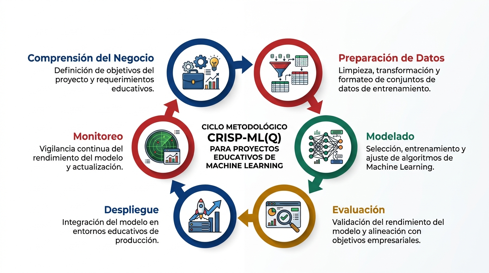
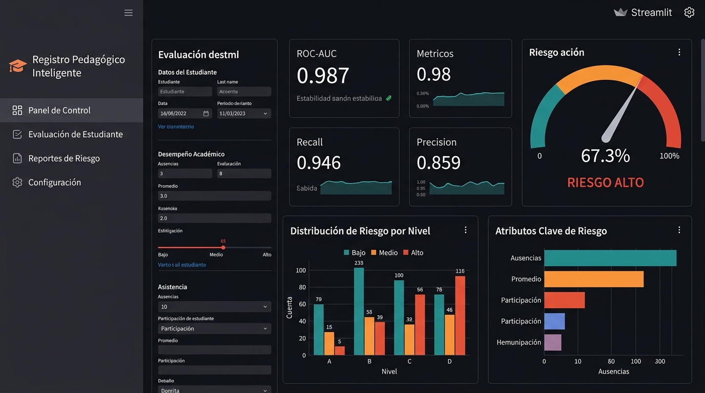

# 🖼️ Galería de Imágenes del Proyecto

## Imágenes del Proyecto

### Banner Principal

*Banner principal del proyecto que muestra el panel de analítica estudiantil, la integración de inteligencia artificial con Machine Learning y el flujo metodológico CRISP-ML(Q).*

---

### Arquitectura CRISP-ML(Q)

*Diagrama del ciclo metodológico CRISP-ML(Q) aplicado al proyecto educativo, mostrando las 6 fases: Comprensión del Negocio, Preparación de Datos, Modelado, Evaluación, Despliegue y Monitoreo.*

---

### Preview del Dashboard

*Vista previa del panel de control de la aplicación Streamlit, mostrando la evaluación de riesgo estudiantil con métricas del modelo, distribución de riesgo por nivel y atributos clave.*

---

## Recursos HTML del Proyecto

### Landing Page Autónoma
📁 **Archivo:** [`landing/index.html`](../landing/index.html)

La landing page es un archivo HTML completamente autónomo que:
- ✅ Funciona sin internet y sin servidor
- ✅ Los datos del estudiante **nunca salen del equipo**
- ✅ Incluye el modelo de ML embebido en JavaScript
- ✅ Genera planes de acompañamiento pedagógico
- ✅ Soporta tema claro/oscuro

**Para usarla:** Abra el archivo con doble clic en cualquier navegador.

### Características de la landing:
- **Formulario completo** con todos los indicadores del registro escolar
- **Medidor de riesgo** con probabilidad y banda de color
- **Plan de acompañamiento** sugerido según los indicadores
- **Proyección de calificación** según las reglas del MINERD
- **Registro acumulado** con almacenamiento local del navegador
- **Exportación CSV** del registro para el equipo de gestión

---

## Figuras del Cuaderno

Las siguientes figuras se generan automáticamente al ejecutar el cuaderno `CRISP_ML_Registro_Pedagogico.ipynb`:

| # | Figura | Descripción |
|---|--------|-------------|
| 1 | Distribución de calificaciones | Histograma de notas por período |
| 2 | Matriz de correlación | Relaciones entre variables numéricas |
| 3 | Curva ROC | Comparación de los 4 modelos candidatos |
| 4 | Curva Precisión-Recall | Balance entre precisión y sensibilidad |
| 5 | Matriz de confusión | Clasificación correcta vs errores |
| 6 | Calibración | Probabilidades predichas vs frecuencia observada |
| 7 | Importancia de variables | Coeficientes del modelo por magnitud |
| 8 | Equidad por subgrupo | Métricas segmentadas por grado, tanda, apoyo |
| 9 | Distribución de bandas | Proporción BAJO/MEDIO/ALTO del aula |

> **Nota:** Para generar estas figuras, ejecute el cuaderno completo. Las figuras se guardan en `reports/figuras/` y se muestran automáticamente en la sección "Acerca del modelo" de la aplicación Streamlit.

---

## Enlaces Directos

| Recurso | Enlace |
|---------|--------|
| 🖼️ Banner del proyecto | [Ver imagen](../assets/images/banner_rpi.jpg) |
| 🖼️ Diagrama CRISP-ML(Q) | [Ver imagen](../assets/images/arquitectura_crisp.jpg) |
| 🖼️ Preview del dashboard | [Ver imagen](../assets/images/dashboard_preview.jpg) |
| 🌐 Landing page HTML | [Abrir en navegador](../landing/index.html) |
| 📊 Aplicación Streamlit | Ejecutar `streamlit run app.py` |
